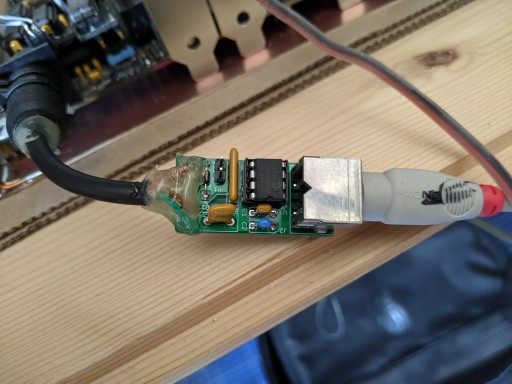

# Another AT2XT Adapter

## Introduction

This is nothing more than another PCB for the AT2XT project you can find [HERE](https://www.vcfed.org/forum/forum/vcwiki/vcwiki-aa/26861-at2xt-keyboard-converter?26426-AT2XT-keyboard-converter=).

I needed something slightly smaller than what provided for the original project, and that did not need as many connector cables. So I've designed this to cater to my needs.



### Disclaimer

I take NO responsibility for what happens if you decide to build and use this card. Your computer might crash, catch fire or be destroyed in other nasty ways.
You're encourauged to take what you deem fit from this, and use it in your projects!

### Pinout of XT connector

```text
1 - KB CLOCK
2 - KB DATA
3 - NC
4 - GND
5 - +5v
```

## Bill of Materials

```text
- J1: Wire it to a cable ending in a 5 pin DIN according to the pinout above
- J2: 6-pin mini-din female. Mouser 571-5749180-1
- JP1: 2 pin male header, 2.54mm spacing
- D1: 1N4148
- U1: PIC12F629, DIP8
- RN1: 3x10k bussed resistor, 4 pin. Mouser 652-4604X-1LF-10K
- C1: 100nF ceramic capacitor, 5mm spacing
- C2: 10uF ceramic capacitor, 5mm spacing
- F1: A wire if you're feeling adventurous, otherwise a polyfuse with 5.08mm spacing, e.g. Mouser 576-16R110BPR
```

Remember to flash the PIC!!! You can find the HEX at the link in the introduction section.

